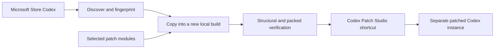
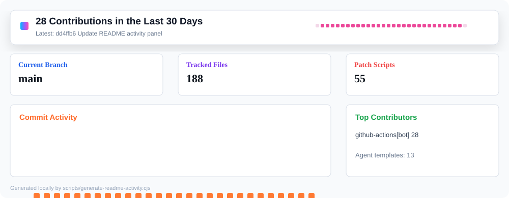

<p align="center">
  
</p>

<h1 align="center">Codex Patch Studio Current</h1>

<p align="center">
  A version-aware Windows patcher that rebuilds a user-controlled Codex desktop clone from the currently installed Codex package.
</p>

<p align="center">
  
  
  
  
  
</p>

## Purpose

This is the successor to the preserved pinned Codex patcher in `RyanCraighead/chat-store`. The old repository and its known-good Codex base remain unchanged. This repository has no pinned-base build path: it discovers the newest installed `OpenAI.Codex` package, fingerprints it, applies structural patch modules, verifies the packed result, and launches a separate clone.

The stock Codex installation is never edited in place.

## Features

- Loads the complete lightweight native chat catalog through a tokenized loopback app-server shim while leaving full conversation bodies lazy until opened. The default ceiling is 10,000 chats.
- Adds native settings routes for Providers, Auto Router, Prompt Tools, Personas, Orchestrations, Swarm, Imports, Patcher, and Feature Development.
- Adds OpenAI, DeepSeek, Z.ai GLM, Alibaba Qwen/DashScope, Cerebras, Ollama, LM Studio, and custom-provider model controls to the chat model picker.
- Supports provider model discovery, visible-model filtering, reasoning controls, API-key setup, and local Responses API compatibility proxies.
- Adds model routing, editable review/default prompts, prompt test panels, reusable personas, and subagent model templates.
- Adds multi-project orchestration chats and child-chat tracking in the native sidebar.
- Imports and repairs Augment, Kiro, Roo Code, and Cline chats through the validated close/import/relaunch workflow.
- Shares the stock chat database and session archive while keeping patched configuration, Electron state, caches, and process state isolated.
- Detects installed Codex changes at launch with Off, Notify, and Auto rebuild policies.
- Builds every candidate into a new immutable clone, verifies it, and switches the launcher only after it passes.
- Provides a source-only feature framework for core, community, and private local modules.
- Includes separate Codex skills for private self-modification and reviewable upstream contributions.

See [Features](docs/FEATURES.md) and [Architecture](docs/ARCHITECTURE.md) for the full breakdown.

## How It Works

Codex Patch Studio is a launcher and local build system, not a replacement installer. It discovers the Codex version already installed from the Microsoft Store, copies that application into a user-controlled build directory, applies the selected source-only feature modules, verifies the result, and records the verified clone in an ignored local launcher file.



The Store installation is never modified. A rebuild is created beside the previous known-good build, and the launcher switches only after verification succeeds. Generated clones, local configuration, credentials, and chats are never committed to this repository.

## Install And First Run

### 1. Install the requirements

- Windows 11 with the Microsoft Store Codex app installed and working.
- [Git for Windows](https://git-scm.com/download/win).
- Node.js 22 or newer, including npm.
- PowerShell 5.1 or PowerShell 7.
- Enough free space for a second local copy of Codex.

Because this repository is private, the GitHub account used by Git or GitHub CLI must have access to it.

### 2. Clone and install the patcher

Open PowerShell in the directory where the source repository should live:

```powershell
git clone git@github.com:RyanCraighead/codex-patch-studio-current.git
Set-Location .\codex-patch-studio-current
npm ci
```

An authenticated HTTPS clone works as well:

```powershell
git clone https://github.com/RyanCraighead/codex-patch-studio-current.git
```

### 3. Optionally put generated builds on another drive

The default build directory is `%LOCALAPPDATA%\CodexPatchStudioCurrent\builds`. To use another drive, create the ignored file `config/patcher.local.json` before setup:

```json
{
  "outputRoot": "E:\\CodexPatchStudioCurrent\\builds"
}
```

Do not commit this machine-specific file.

### 4. Build and create the launcher

Run this from the repository directory:

```powershell
npm run setup
```

Setup performs the following actions:

1. Detects and fingerprints the newest installed Codex Store package.
2. Asks for an update policy: `Off`, `Notify`, or `Auto rebuild`. `Notify` is recommended.
3. Resolves and validates the enabled patch modules.
4. Builds and verifies a new immutable patched clone.
5. Writes ignored machine-local launcher metadata.
6. Creates `Codex Patch Studio Current.lnk` on the desktop.

The first patched launch initializes `%USERPROFILE%\.codex-patch-studio-current`, starts the required loopback services, and opens the verified clone.

## Launching Both Codex Instances

Stock Codex and patched Codex are separate application instances and can run at the same time.

| Instance | How to launch it | Configuration | Chats |
| --- | --- | --- | --- |
| Stock Codex | Use the normal **Codex** entry in the Windows Start menu, taskbar, or Microsoft Store installation. | `%USERPROFILE%\.codex\config.toml` | Canonical stock sessions and database |
| Patched Codex | Double-click **Codex Patch Studio Current** on the desktop, or run `npm run launch:codex` from this repository. | `%USERPROFILE%\.codex-patch-studio-current\config.toml` | Shared stock sessions and database by default |

Launching the patched shortcut stops only an older patched instance before reopening it. It does not stop stock Codex. Launch stock Codex normally first or afterward; the order does not matter.

Always launch the patched version through its shortcut or `npm run launch:codex`. Do not run a generated clone's `Codex.exe` directly. Direct execution bypasses the update check, isolated environment variables, provider proxies, import manager, patch manager, and all-chats catalog shim.

## Everyday Use

1. Launch normal Codex from its normal Windows icon when you want the unmodified application.
2. Launch **Codex Patch Studio Current** when you want patched settings, providers, orchestration, imports, routing, personas, or the expanded chat catalog.
3. Configure patched-only behavior from the added pages under **Settings**. Changes there use the patched Codex home and do not overwrite stock `config.toml`.
4. Keep the source checkout on disk. The desktop shortcut targets its launcher scripts and cannot operate after the repository is moved or deleted.
5. When Codex updates, use the launch-time prompt. A failed rebuild leaves the last verified clone selected.

## Common Commands

Run these from the repository directory:

| Command | Purpose |
| --- | --- |
| `npm run setup` | First setup, update-policy selection, verified build, and desktop shortcut creation |
| `npm run launch:codex` | Launch the managed patched instance while leaving stock Codex alone |
| `npm run check:current` | Compare installed Codex, patcher source, and the selected verified build without changing anything |
| `npm run update:current` | Force a new verified build from the currently installed Codex package |
| `npm run shortcut:codex` | Recreate the desktop shortcut after it was deleted or the icon changed |
| `npm run features:list` | List discovered core, community, and local feature modules |
| `npm run features:validate` | Validate feature manifests, dependencies, adapters, and conflicts |
| `npm run check:source-only` | Confirm that no generated Codex material, credentials, or user data entered Git |
| `npm test` | Run the repository test suite |
| `npm run test:live` | Verify the locally selected patched build |
| `npm run bundle:codex` | Create a local-only self-extracting package from the verified clone |

To update the patcher source itself:

```powershell
git switch main
git pull --ff-only
npm ci
npm run setup
```

The patcher never silently replaces its own source checkout. Launch-time remote checks can report a newer source release, but the user still updates Git explicitly.

## Local Bundle

After setup, this creates a self-extracting package for use on the same machine:

```powershell
npm run bundle:codex
```

The bundle is a local-only artifact containing the user's installed Codex copy. It must not be published, shared, committed, released, or uploaded.

By default, bundle launches reuse the stable non-portable Electron profile at `%LOCALAPPDATA%\CodexPatchStudioCurrent\electron-user-data`. Pass `-PortableElectronProfile` to use an isolated per-bundle profile:

```powershell
npm run bundle:codex -- -PortableElectronProfile
```

## Basic Troubleshooting

- **Desktop shortcut is missing:** run `npm run shortcut:codex`.
- **Patched Codex reports an installed-version change:** accept the rebuild prompt or run `npm run update:current`.
- **A rebuild fails:** the launcher keeps the last verified clone. Read `codex-launch-debug\patched-codex-launch.log`, then run `npm run check:current` for the recorded reasons.
- **Patched settings or local bridges are unavailable:** close only the patched window and relaunch it through the patched shortcut so its services start again.
- **Stock and patched settings affect each other:** verify that patched Codex was started through the managed launcher and that `CODEX_HOME` resolves to `%USERPROFILE%\.codex-patch-studio-current` in its diagnostics.
- **Chats are missing from one instance:** do not delete `%USERPROFILE%\.codex`. That is the canonical chat archive. Run `npm run test:live` and use the patched Imports/repair tools after making a backup.
- **The repository was moved:** run `npm run setup` from the new path to rebuild the shortcut and local launcher metadata.

For deeper update diagnostics, see [Update Lifecycle](docs/UPDATE-LIFECYCLE.md). For package boundaries and portability, see [Portable Builds](docs/PORTABLE.md).

## Update Behavior

The launcher compares four local things before every launch:

1. Installed Codex version.
2. Installed package identity, location, and `app.asar` fingerprint.
3. Generated clone, launcher metadata, and executable presence.
4. Patcher source fingerprint.

It can also consult the cached repository stable-channel manifest when that optional channel is enabled. The committed channel is disabled by default because this repository is private; manual **Check updates** remains available, and `manifestUrl` can be overridden with a reachable HTTPS endpoint.

If nothing changed, launch is immediate. When Codex or patcher source changes, behavior follows the selected policy:

- `Off`: launch the last verified clone without checking Codex or GitHub.
- `Notify`: check once and ask before rebuilding. If the optional repository channel is enabled and reachable, it also reports a newer source release. This is the recommended default.
- `Auto rebuild`: check once and start a locally verified Codex rebuild without prompting. Remote source is still never installed silently.

Each candidate is built in a new directory while the known-good clone remains intact. The launcher config switches only after JavaScript, structural, and packed verification passes. If a running patched app needs to move to the new clone, only that old clone is stopped and relaunched; stock Codex remains open. Failed candidates never replace the last verified clone.

Core modules currently use a tested `26.707.x` adapter family. Later numeric `26.707.*` Store revisions can rebuild automatically only if every structural and packed check still passes. A new Store family, an ambiguous anchor, or an overlapping adapter fails closed and leaves the last verified clone selected until a compatible adapter is added.

Compatibility records in `config/compatibility.json` describe builds already validated by this repository; they do not pin the source build. `update-channel/stable.json` is a source-only projection of those records that can be published at a reachable endpoint. When enabled, it is cached atomically, tolerates offline launches, and reports exact Codex and patcher-source fingerprint matches rather than trusting a numeric "supports up to" version. See [Update Lifecycle](docs/UPDATE-LIFECYCLE.md).

## Data Model

| Data | Stock Codex | Patched Codex |
| --- | --- | --- |
| App files | Signed Store package | Separate patched clone |
| Configuration | `%USERPROFILE%\.codex\config.toml` | `%USERPROFILE%\.codex-patch-studio-current\config.toml` |
| Electron profile | Stock profile | Separate configured profile |
| Sessions | Canonical stock archive | Junction to stock sessions |
| `state_5.sqlite` | Canonical chat index | NTFS hard link to stock database |
| Provider keys | Windows user environment | Read at proxy launch; never copied into Git |

This arrangement makes the same projects and chats visible in both applications without allowing provider or model changes in the patched app to overwrite the stock configuration.

## Validation

```powershell
npm run features:validate
npm run check:source-only
npm test
npm run test:live
$env:CODEX_PATCHED_REMOTE_DEBUGGING_PORT = "9229"
npm run launch:codex
npm run test:runtime
npm run test:ui
Remove-Item Env:CODEX_PATCHED_REMOTE_DEBUGGING_PORT
```

The current validated run against Codex `26.707.9981.0` proved:

- Packed ASAR structural verification for every enabled patch module.
- The complete 1,200-plus-thread lightweight catalog fetched across paginated app-server results in under one second, with full bodies left lazy.
- Separate stock and patched `config.toml` files.
- Shared sessions and chat database.
- Healthy import, patch-manager, and all-chats catalog-shim bridges.
- Hundreds of Codex projects indexed in the native Imports page without loading oversized rollout files into one JavaScript string.
- Healthy DeepSeek, Z.ai, DashScope, and Cerebras proxies.
- Rendered native settings pages with screenshot checks.
- Stock and patched Codex running at the same time.

Runtime UI tests use a temporary local Chrome DevTools Protocol port. Set
`CODEX_PATCHED_REMOTE_DEBUGGING_PORT` before launching the patched app so the
launcher exposes that port to the two verifiers. Normal shortcut launches do
not expose it.

## Distribution Boundary

This repository and its releases are source-only. They do not contain Codex executables, `app.asar`, extracted webview bundles, generated clones, chat databases, credentials, or self-extracting application packages. The patcher reads a lawfully installed local Codex package and creates a local ignored clone on the user's own machine.

`npm run check:source-only` enforces this boundary in tests and CI. Do not attach locally generated application packages to issues, pull requests, or releases. See [Distribution Boundary](docs/PORTABLE.md).

## Feature Development

Installed feature types:

- `core`: built-in, maintained feature metadata tied to the proven patch implementation.
- `contribution`: source-only modules under `features/community`, disabled until selected.
- `local`: private modules under `%USERPROFILE%\.codex-patch-studio-current\features`, ignored by this repository.

```powershell
npm run features:list
$launcher = Get-Content .\codex-launcher.local.json -Raw | ConvertFrom-Json
npm run feature:start -- --mode local --feature local.my-feature --slug my-feature --codex-version $launcher.sourceVersion --source-asar-sha256 $launcher.sourceAsarSha256 --source-cli-sha256 $launcher.sourceAppServerCliSha256
npm run feature:status
npm run feature:checkpoint -- --milestone first-successful-patch
npm run feature:convert -- --feature example.my-feature
```

The native Feature Development settings page lists core, community, and local modules with compatibility, source commit, and build/test status. It can create a local feature worktree, convert local work into a contribution, open its worktree, toggle modules, and start an immutable verified rebuild through guarded one-shot bridge commands. Local and contribution modules run in an isolated data-only VM with a restricted synchronous patch context; trusted built-in modules can invoke only the builder operations owned by their feature ID. Every module must pass unpacked and packed verification. See [Feature Development](docs/FEATURE-DEVELOPMENT.md) and [Feature Git Workflows](docs/FEATURE-WORKFLOWS.md).

## Local Services

| Service | Address |
| --- | --- |
| Import manager | `http://127.0.0.1:4577` |
| Patch manager | `http://127.0.0.1:4590` |
| DeepSeek proxy | `http://127.0.0.1:47731` |
| Z.ai proxy | `http://127.0.0.1:47732` |
| DashScope proxy | `http://127.0.0.1:47733` |
| Cerebras proxy | `http://127.0.0.1:47734` |

All bridges bind to loopback. API keys remain Windows user environment variables and are excluded from logs and repository files.

## Repository Layout

| Path | Responsibility |
| --- | --- |
| `scripts/build-patched-codex-app.cjs` | Structural patch engine and packed verification |
| `scripts/feature-registry.cjs` | Source-only feature discovery, resolution, restricted execution, and verification |
| `scripts/feature-development-workflow.cjs` | Local/contribution worktrees, metadata, milestone commits, push, and draft PR workflow |
| `scripts/codex-update-policy.psm1` | Tested Off, Notify, Auto, prompt, and failure decisions |
| `scripts/check-remote-update-channel.cjs` | Cached GitHub source-release and exact Codex compatibility status |
| `scripts/generate-update-channel.cjs` | Deterministic stable-channel generation and CI drift check |
| `scripts/check-source-only.cjs` | Distribution, credential, and copied-source guard |
| `scripts/ensure-current-codex-patch.ps1` | Update detection, patched-only stop, rebuild, relaunch |
| `scripts/launch-patched-codex.ps1` | Isolated runtime initialization and service startup |
| `native-patches/` | Shared managed agent templates used by the patched profile |
| `viewer/` | Multi-source import manager |
| `codex-viewer/` | Codex project/chat and patch manager |
| `config/compatibility.json` | Previously validated current-build fingerprints |
| `config/update-channel.json` | Optional channel enablement, local revision, URL, timeout, and cache policy |
| `update-channel/stable.json` | Publishable source-only compatibility and patcher release manifest |
| `features/core/` | Independent built-in modules with manifests, tested version-family adapters, payloads, tests, and docs |
| `features/community/` | Reviewable source-only contribution modules |
| `.agents/skills/` | Local-feature and contribution authoring workflows |
| `tests/` | Source contracts and patch payload checks |

## Safety And Scope

This project is local interoperability and repair tooling for a lawfully installed application and the user's own chat data. Generated app clones, exports, chat backups, logs, API keys, Electron profiles, local modules, and local launcher configuration are ignored by Git. No Microsoft Store application files, extracted bundles, or generated executables may be committed or released.

See [Security](SECURITY.md) before publishing logs or build artifacts.

## Repository Activity

<p align="center">
  
</p>
